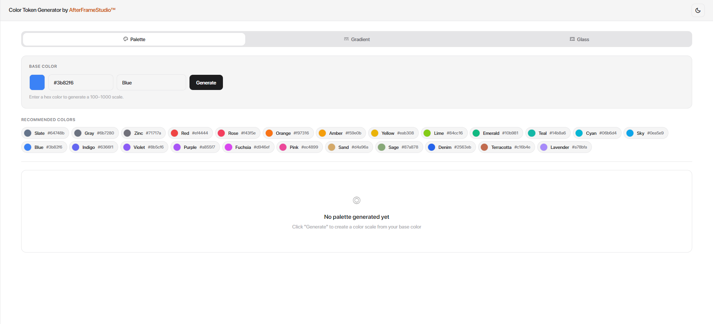

# Color Token Generator

> Free generate and preview color effects & style for UI/UX Designers, Developers, and Students


## 🎨 Live Demo

**[🚀 Color Token Generator](https://color-effect-generator.vercel.app/)**

## 📖 Overview

Color Token Generator is a free web application designed to help UI/UX Designers, Developers, and Students create and preview color palettes, gradients, and glass morphism effects in real-time. Whether you're designing a new interface or learning about color theory, this tool makes it easy to generate professional color tokens and visual effects.

## ✨ Features

- **🎨 Palette Generator**
  - Input base color (Hex, RGB, or HSL)
  - Automatically generates complete color scale (100-1000)
  - View recommended colors with naming
  - Multiple layout options (Columns, Cards, Rows)
  - Copy colors in various formats

- **🌈 Gradient Generator**
  - Create custom linear gradients
  - Adjust angle, colors, and stops
  - Preview in real-time
  - Copy gradient CSS code

- **✨ Glass Morphism Generator**
  - Create glass effect designs
  - Customize blur, opacity, and tint colors
  - Live preview with adjustable parameters
  - Generate CSS code ready to use

- **🌙 Dark Mode**
  - Seamless light/dark theme switching
  - Persisted user preference
  - Smooth transitions between themes

- **📋 Copy to Clipboard**
  - One-click copy for colors and code
  - Toast notifications for feedback
  - Multiple format support

## 🛠️ Tech Stack

- **Frontend Framework:** React 19.2.4
- **Build Tool:** Vite 8.0.4
- **Animation Library:** Framer Motion 12.38.0
- **Styling:** CSS with CSS Variables
- **Deployment:** Vercel
- **Font:** Bricolage Grotesque (Google Fonts)

## 🚀 Quick Start

### Prerequisites
- Node.js (v16 or higher)
- npm or yarn
- Git
- GitHub account

### Installation

#### Option 1: Fork the Repository (Recommended)

1. **Fork the repository**
   - Go to [Color Token Generator Repository](https://github.com/andikafahrezi/color-effect-generator)
   - Click the **[Fork]** button in the top-right corner
   - This creates a copy of the repository in your GitHub account

2. **Clone your fork**
   ```bash
   git clone https://github.com/YOUR_USERNAME/color-effect-generator.git
   cd color-effect-generator
   ```
   
   Replace `YOUR_USERNAME` with your actual GitHub username.

3. **Set up upstream remote** (to keep your fork in sync)
   ```bash
   git remote add upstream https://github.com/andikafahrezi/color-effect-generator.git
   ```

4. **Install dependencies**
   ```bash
   npm install
   ```

5. **Start development server**
   ```bash
   npm run dev
   ```

6. **Open in browser**
   ```
   http://localhost:5173
   ```

#### Option 2: Clone Directly (Read-Only)

If you just want to run the project locally without contributing:

```bash
git clone https://github.com/andikafahrezi/color-effect-generator.git
cd color-effect-generator
npm install
npm run dev
```

### Why Fork?

Forking allows you to:
- Contribute back to the original project via Pull Requests
- Maintain your own version of the project
- Keep your fork in sync with the original repository
- Learn Git workflows and collaboration practices

## 📚 Usage Guide

### Palette Generator

1. **Input Base Color**
   - Click the color picker or enter hex code
   - Type color name (optional)

2. **Generate Palette**
   - Click `Generate` button
   - System creates 100-1000 color scale

3. **View Results**
   - Switch between Columns, Cards, or Rows layout
   - Hover over colors for details
   - Click hex code to copy

4. **Copy Colors**
   - Click color hex to copy
   - Get instant confirmation via toast

### Gradient Generator

1. **Select Gradient Type**
   - Choose linear gradient direction
   - Adjust angle (0-360°)

2. **Customize Colors**
   - Add/remove color stops
   - Adjust color position
   - Set gradient angle

3. **Preview & Copy**
   - Real-time gradient preview
   - Copy CSS code ready to use

### Glass Morphism Generator

1. **Adjust Parameters**
   - **Blur:** Set blur amount (px)
   - **Opacity:** Control transparency (%)
   - **Tint Color:** Choose glass tint color
   - **Backdrop Filter:** Adjust intensity

2. **Preview Effect**
   - See live preview with gradient background
   - Adjust settings in real-time
   - Visual feedback immediately

3. **Get CSS Code**
   - Copy generated CSS
   - Ready to paste in your project

## 🌙 Dark Mode

Toggle dark mode using the button in the header:
- ☀️ Light Mode (default)
- 🌙 Dark Mode (toggle available)

Preference is automatically saved to your browser.

## 📸 Screenshots

### Palette Generator
> [Add screenshot of Palette tab here - both light and dark mode]
> Use the guide below to add screenshots

### Gradient Generator
> [Add screenshot of Gradient tab here]

### Glass Morphism Generator
> [Add screenshot of Glass tab here]

### Dark Mode
> [Add screenshot showing dark mode theme]

## 📸 How to Add Screenshots to README

Follow these steps to add your own screenshots:

### Step 1: Take Screenshots
1. Open the app in browser
2. Take screenshots of each tab (Palette, Gradient, Glass)
3. Also take screenshots in both light and dark modes
4. Save with clear names: `palette-light.png`, `dark-mode.png`, etc.

### Step 2: Create Screenshots Folder
1. In your GitHub repository, create a new folder: `screenshots/`
2. Upload all screenshot files there

### Step 3: Update README with Image Links
Replace the placeholder comments with actual markdown image syntax:

```markdown
### Palette Generator - Light Mode


### Palette Generator - Dark Mode


### Gradient Generator


### Glass Morphism Generator

```

### Step 4: Commit and Push
```bash
git add screenshots/
git add README.md
git commit -m "Add screenshots to README"
git push origin main
```

## 🔄 Workflow

### Color Token Generation Workflow
```
1. Input Base Color
   ↓
2. Click Generate
   ↓
3. Review Generated Palette Scale
   ↓
4. Choose Layout (Columns/Cards/Rows)
   ↓
5. Copy Desired Colors
   ↓
6. Use in Your Project
```

### Gradient Creation Workflow
```
1. Adjust Gradient Angle
   ↓
2. Customize Color Stops
   ↓
3. Preview in Real-time
   ↓
4. Copy CSS Code
   ↓
5. Paste in Project
```

### Glass Effect Workflow
```
1. Adjust Blur, Opacity, Tint
   ↓
2. Preview Effect
   ↓
3. Fine-tune Parameters
   ↓
4. Copy CSS Code
   ↓
5. Implement in Design
```

## 🚧 Planned Features

- [ ] Export palettes as JSON/CSS
- [ ] Color history / favorites
- [ ] Accessibility color contrast checker
- [ ] Share generated palettes via URL
- [ ] Color blind friendly mode
- [ ] Figma plugin integration
- [ ] Mobile app version

## 📁 Project Structure

```
color-effect-generator/
├── src/
│   ├── components/
│   │   ├── shared/          # Reusable components
│   │   ├── Header.jsx
│   │   ├── MainTabs.jsx
│   │   └── Toast.jsx
│   ├── panels/
│   │   ├── PalettePanel.jsx
│   │   ├── GradientPanel.jsx
│   │   └── GlassPanel.jsx
│   ├── contexts/
│   │   └── ThemeContext.jsx
│   ├── data/
│   │   └── (color data files)
│   ├── utils/
│   │   └── (utility functions)
│   ├── App.jsx
│   └── index.css
├── public/
├── package.json
└── README.md
```

## 🤝 Contributing

Contributions are welcome! Whether it's bug reports, feature requests, or code improvements, feel free to contribute.

### How to Contribute

1. **Fork the repository**
   ```bash
   # Click "Fork" button on GitHub
   ```

2. **Clone your fork**
   ```bash
   git clone https://github.com/YOUR_USERNAME/color-effect-generator.git
   cd color-effect-generator
   ```

3. **Create a feature branch**
   ```bash
   git switch -c feature/your-feature-name
   ```

4. **Make your changes**
   - Write clean, readable code
   - Follow existing code style
   - Test your changes

5. **Commit and push**
   ```bash
   git add .
   git commit -m "Add: your feature description"
   git push -u origin feature/your-feature-name
   ```

6. **Create Pull Request**
   - Go to GitHub and create a PR
   - Describe your changes clearly
   - Wait for review

## 🐛 Bug Reports

Found a bug? Please create an issue with:
- **Description:** What's the problem?
- **Steps to Reproduce:** How to recreate the bug?
- **Expected Behavior:** What should happen?
- **Actual Behavior:** What actually happens?
- **Screenshots:** If applicable

## 📄 License

This project is licensed under the MIT License - see the [LICENSE](LICENSE) file for details.

## 👨‍💻 Author

**Andika Fahrezi**

- **Portfolio:** [andikafahrezi.framer.ai](https://andikafahrezi.framer.ai)
- **Instagram:** [@andikafahrezii](https://instagram.com/andikafahrezii)
- **Email:** andfrz09@gmail.com

## 💡 Inspiration & Credits

This project was created to help designers and developers quickly generate and preview color effects. Built with ❤️ using React and modern web technologies.

---

## 📞 Support

If you have any questions or need help, feel free to:
- Open an issue on GitHub
- Email: andfrz09@gmail.com
- Visit portfolio: https://andikafahrezi.framer.ai

---

**Happy designing! 🎨**